# 2025年你必须了解的18款顶级AI营销自动化工具

在社交媒体营销越来越复杂的当下,手动管理多个平台既耗时又难以保持一致性。AI营销自动化工具通过智能内容生成、自动发布和数据分析,帮助企业主和营销团队节省80%以上的内容创作时间。本文汇总18款经过实测的工具,覆盖从文案创作、社交媒体排程到邮件营销自动化的全流程需求,无论你是初创团队还是成熟企业,都能找到适合自己业务规模和预算的解决方案。

## **[Blaze](https://www.blaze.ai)**

全自动AI营销助手,零人工干预实现内容策略到发布的完整闭环

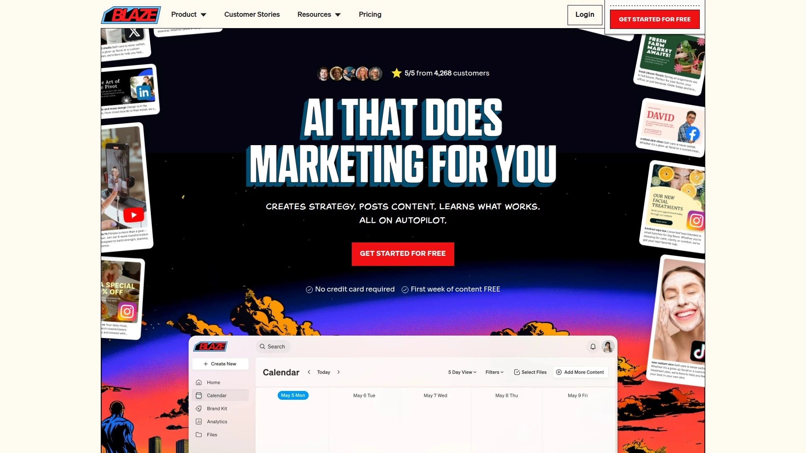

Blaze通过深度学习用户的品牌语调、写作风格和视觉偏好,自动生成高度个性化的营销内容。系统运行完全自主化,从策略制定、内容创作、多平台发布到效果分析全程无需人工介入。平台内置学习循环机制,持续追踪用户互动数据(点击、分享、参与度),自动优化后续内容方向。客户数据显示,使用3个月内网站流量平均增长300%。适合时间紧张的企业主,尤其是需要同时管理10个以上社交平台但缺乏专业营销团队的中小企业。用户只需每周查收邮件报告,无需日常操作。相比传统代理机构,成本降低99%且全天候运作。

## **[SocialBee](https://socialbee.com)**

AI策略生成器+自动化发布系统,5分钟搭建完整社媒营销计划

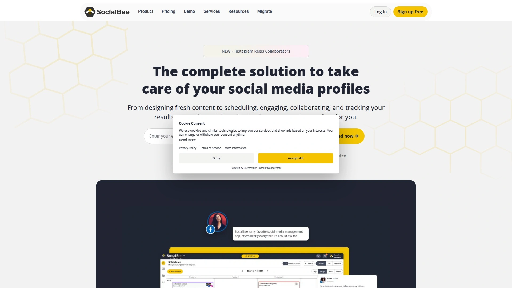

这款工具最大的亮点是AI Copilot功能,通过问答式交互自动生成完整的社交媒体战略。系统会询问品牌目标、受众特征和内容偏好,然后推荐最适合的平台组合、最佳发布时段、内容类型配比,并预先生成数十条待发布帖子。内容分类功能允许设置不同主题的循环发布规则,自动回收常青内容。内置AI写手可快速生成符合品牌调性的文案,社交收件箱统一管理所有平台的评论和私信。支持从Canva导入设计素材,Unsplash图库直接调用。免费试用14天,付费版起价约49美元/月,提供无限制字数生成。适合需要系统化管理社交媒体但缺乏策略经验的小团队。

## **[Jasper AI](https://www.jasper.ai)**

品牌一致性最强的长篇内容生成工具,企业级营销团队首选

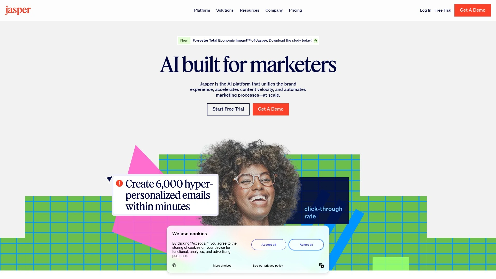

Jasper专注于高质量长文创作和品牌声音统一管理。其Boss Mode支持生成SEO优化的长篇博客文章,语法准确度和内容连贯性在同类工具中表现突出。品牌声音功能允许团队设置统一的语调规范,确保不同成员创作的内容保持一致性。集成Copyscape防抄袭检测,保证内容原创性。适用场景包括白皮书撰写、产品说明页、电商详情页等需要专业表达的营销材料。界面相对复杂,新用户需要一定学习时间。定价从每月59美元起,Boss Mode计划限额30,000字。更适合年收入100万美元以上、拥有专职内容团队的企业。

## **[Copy.ai](https://www.copy.ai)**

快速短文案生成专家,性价比最高的Go-to-Market自动化方案。平台提供80多个预设模板,涵盖社交媒体文案、广告标题、产品描述等常见场景。每次运行生成10个备选方案,用户可快速挑选最佳版本。Pro计划提供无限字数生成,月费49美元,比同类工具便宜约20%。内置抄袭检测确保内容独特性。主要侧重短文案,不适合需要深度长文的用户。操作流程简化为"选择模板-输入信息-获取内容"三步。适合初创公司和需要批量生成广告文案的电商卖家。

## **[Writesonic](https://writesonic.com)**

SEO功能最全面的AI写作平台,整合Semrush关键词研究

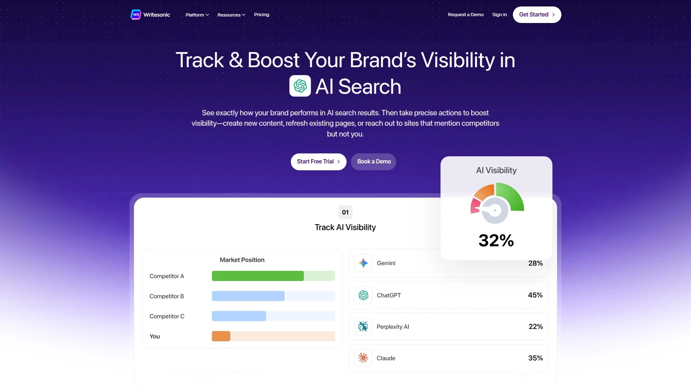

Writesonic在SEO优化方面表现优异,集成Semrush进行关键词研究和内容优化。30秒内生成1500字文章,速度比竞品快4倍。Chatsonic聊天机器人支持GPT-4能力,可通过自然对话生成内容。Photosonic工具根据文字描述生成AI配图。支持24种语言,适合跨国团队。80多个模板覆盖从TikTok脚本到落地页文案的全场景。定价比Jasper便宜约75%,性价比突出。免费版有限额,付费版起步价格亲民。适合预算有限但需要专业SEO内容的博主和中小企业。

## **[HubSpot](https://www.hubspot.com)**

CRM+营销自动化一体化巨头,适合复杂销售流程的大型企业

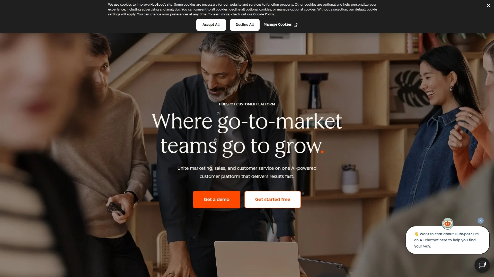

HubSpot整合客户关系管理和营销自动化,特别适合销售周期超过3个月的B2B企业。AI功能包括潜在客户细分、个性化客户旅程、自动跟进邮件和行为追踪。多部门协作能力强,销售、客服、营销团队可共享数据。提供精细的归因报告,清楚显示每个营销触点的转化贡献。实测数据显示专业服务公司使用后潜在客户转化率提升23%。缺点是设置复杂,首次配置需要32小时,建议聘请实施顾问。年收入100万美元以下的企业可能感觉功能过剩。首年总成本约8,200美元。更适合拥有专职营销团队和年收入超过100万美元的成熟企业。

## **[ActiveCampaign](https://www.activecampaign.com)**

中小企业最佳选择,营销自动化和邮件营销的性价比之王

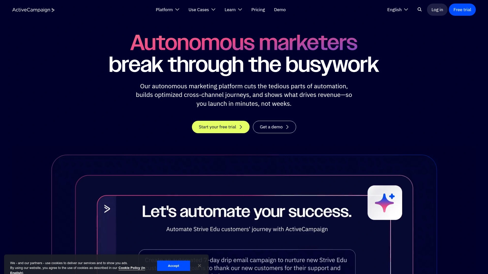

ActiveCampaign在10万至200万美元年收入区间的企业中表现最优。自动化流程设置简单,9小时即可完成基础配置,1周内启动首个营销活动。电商集成顺畅,尤其与Shopify配合,弃购挽回率达22%。邮件送达率行业领先,客户支持响应迅速。AI辅助邮件列表自动分段、内容个性化和A/B测试优化。专业服务公司实测显示潜在客户转化提升28%,每月维护仅需2小时。首年成本约2,100至3,200美元,ROI最高。不适合只需基础邮件功能或联系人少于500的用户。更适合在线销售和需要复杂自动化流程但预算有限的成长型企业。

## **[Mailchimp](https://mailchimp.com)**

入门级邮件营销首选,免费版功能够用且学习曲线最平缓。1000个联系人以下免费使用,适合初创阶段。拖拽式界面无需编程知识,4小时完成设置,3天内发出首个活动。AI功能包括基于用户行为的自动邮件列表分段、发送时间优化和基础A/B测试。电商企业实测弃购挽回率14%,低于专业工具但成本仅980美元/年。限制在于自动化能力较弱,不支持复杂工作流。快速增长企业会遇到功能瓶颈,客服支持评价一般。适合年收入10万美元以下、联系人1000以下、只需基础邮件营销的小微企业和个人创作者。

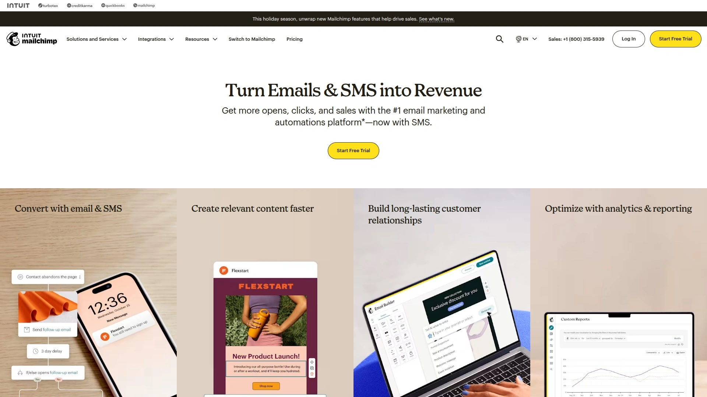

## **[Buffer](https://buffer.com)**

简洁高效的社交媒体排程工具,队列管理功能行业最佳

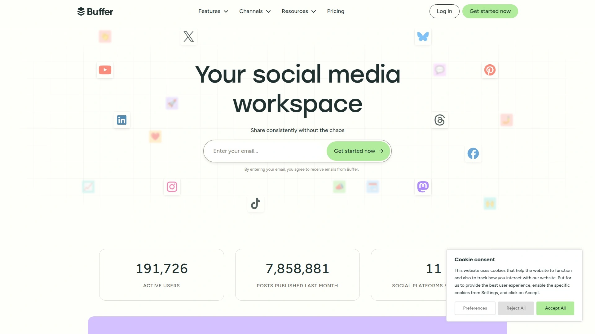

Buffer专注于内容排程的极致简化。队列系统允许预设每日发布时段(如中午12点、下午3点、晚上9点),新内容自动填充到下一个空位。支持从Canva、Unsplash、Google Photos直接导入素材。Idea功能让团队存储和协作未成形的创意。付费版支持首评论预定,绕过LinkedIn链接惩罚机制。连接的社交平台比Hootsuite更多。拖拽式日历重排内容,操作直观。缺点是筛选选项较少,仅支持草稿/已排程/已发布三种状态。更适合小团队和个人创作者,不需要复杂客服功能和深度分析。定价透明,免费版可试用基础功能。

## **[Hootsuite](https://www.hootsuite.com)**

企业级社交媒体管理中心,客服和分析功能最全面

Hootsuite功能全面但界面复杂。支持通过CSV文件批量上传350条帖子,适合大规模内容投放。内置Pixabay免费图库,日历视图支持列表/周/月/社交账号多维度筛选。社交媒体客户服务功能突出,统一回复各平台咨询。分析报告详尽,适合需要向管理层汇报数据的营销团队。缺点是重排内容操作繁琐,不支持拖拽需多步点击。AutoSchedule功能虽便利但无法控制发布顺序。更适合管理多个品牌账号的代理商和大型企业营销部门。不适合只需简单排程的小团队。

## **[Later](https://later.com)**

视觉优先的Instagram营销利器,网格预览功能独一无二。专为视觉内容设计,尤其擅长Instagram、Pinterest等平台。拖拽式网格日历可预览发布后的Feed整体效果,帮助保持视觉一致性。Link in Bio工具优化个人主页链接页面。支持用户生成内容(UGC)管理,方便整理粉丝分享的照片。免费版限制较多,付费版功能逐步解锁。适合服装、美妆、美食等视觉驱动行业的品牌。分析功能不如Hootsuite深入,更侧重内容规划而非客服。适合Instagram为主要营销渠道的创作者和电商卖家。

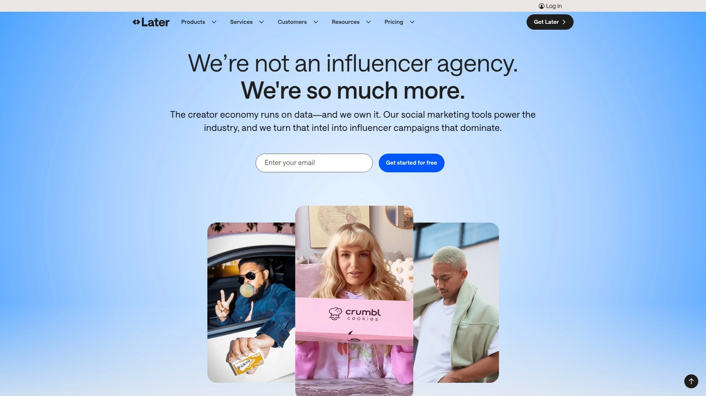

## **[Agorapulse](https://www.agorapulse.com)**

队列排程+品牌倡导功能双强,扩大有机覆盖的秘密武器

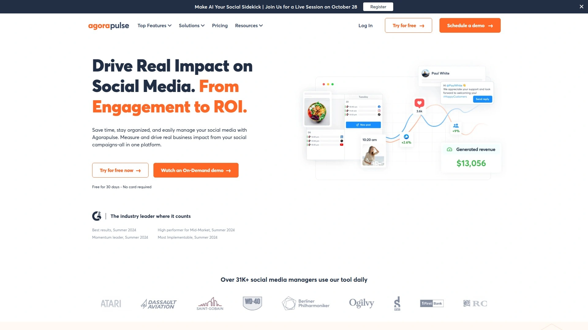

Agorapulse的队列功能让用户无需逐条排程,只需添加内容到队列,系统按预设时间表自动发布。Advocacy工具独树一帜,可自动向品牌倡导者发送邮件,邀请他们分享内容到个人社交媒体,显著扩大有机覆盖。社交收件箱自动汇总所有平台的消息和评论到统一界面。社交聆听功能监测关键词提及,及时捕捉品牌相关讨论。视觉化报告自动整合跨平台数据,分析表现、增长和受众特征。适合拥有员工倡导计划或品牌大使网络的企业,以及需要主动管理品牌声誉的团队。

## **[Vista Social](https://vistasocial.com)**

内置评论管理系统的全能平台,在线声誉管理专家

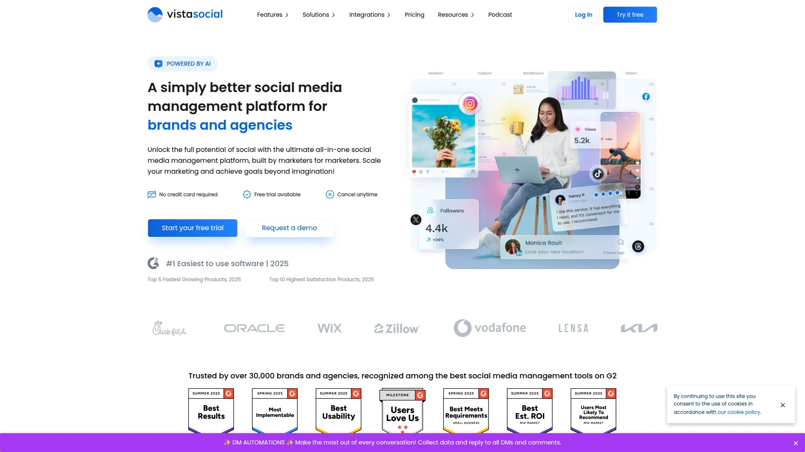

Vista Social是唯一集成评论管理工具的社交媒体自动化平台。ChatGPT驱动的AI写手加速内容创作,统一社交收件箱简化团队协作。自动化发布工具支持跨平台排程,分析工具编译跨网络指标生成综合报告。社交聆听发现相关对话,Link in Bio页面工具优化个人主页。特别适合餐饮、酒店、零售等高度依赖在线评价的行业。团队协作功能完善,内容审批流程清晰。定价灵活,中小企业可承受。

## **[Ocoya](https://www.ocoya.com)**

AI驱动的智能排程中心,创意工具和自动化的完美结合

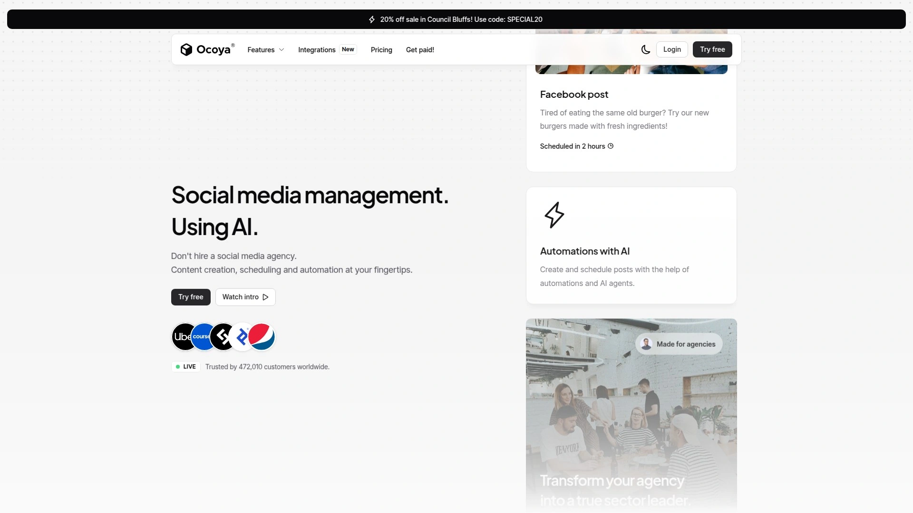

Ocoya定位为使用AI的社交媒体管理中心,提供无缝的排程和内容创作体验。AI协助生成文案和视觉素材,智能推荐最佳发布时间。内置编辑工具支持图片和视频处理,无需跳转第三方平台。个性化功能根据受众行为调整内容策略。跨渠道内容分享简化多平台管理。适合需要快速生成视觉内容并自动发布的创作者和小型代理商。界面友好,初学者容易上手。

## **[ContentStudio](https://contentstudio.io)**

内容营销人员的瑞士军刀,发现-创作-发布-分析全流程覆盖

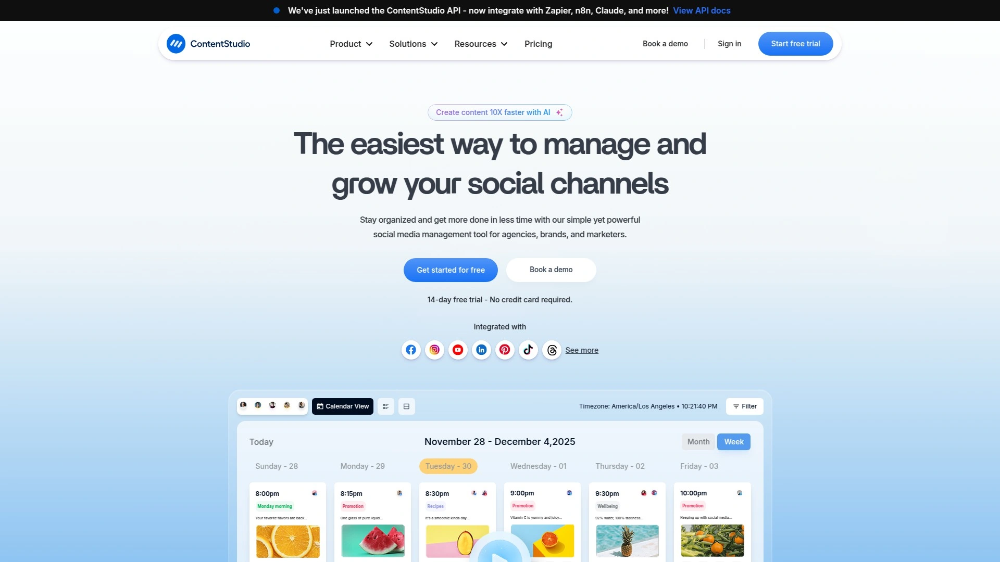

ContentStudio特别擅长内容发现和策划。平台帮助用户发现行业热门话题和趋势内容,自动化发布减少手动操作。工作区功能允许在单一界面组织多个社交账号,适合管理多客户的代理商。Canva集成支持平台内直接设计和编辑图形。移动应用让团队随时随地管理内容。分析功能追踪内容表现,识别高效内容类型。适合内容营销导向的团队和需要持续发现新创意的博主。

## **[Loomly](https://www.loomly.com)**

协作流程最优化的品牌成功平台,团队审批工作流专家

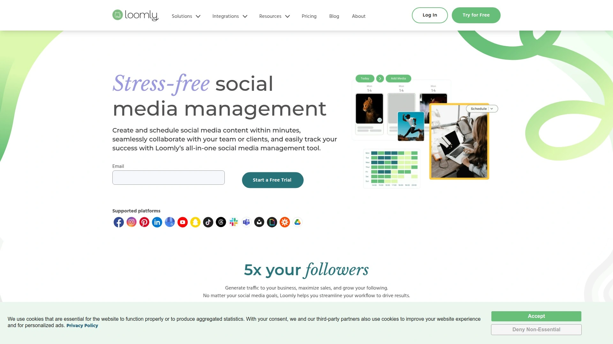

Loomly强调团队协作和发布管理。平台通过协作、发布和分析三大支柱帮助营销团队培育成功品牌。与Canva深度集成,双向同步设计素材和发布计划。内容日历提供网格预览,规划视觉叙事的整体效果。帖子优化提示指导用户完善内容,支持图片alt文本、产品标签、首评论、地理标签等平台特定功能。协作审批工作流让团队成员提交-审核-修改-发布流程清晰。高级分析工具衡量内容影响力。适合3人以上的营销小组和需要内容审批机制的品牌。

## **[Lately AI](https://www.lately.ai)**

长内容转换社交帖子的魔法师,博客转化效率提升10倍

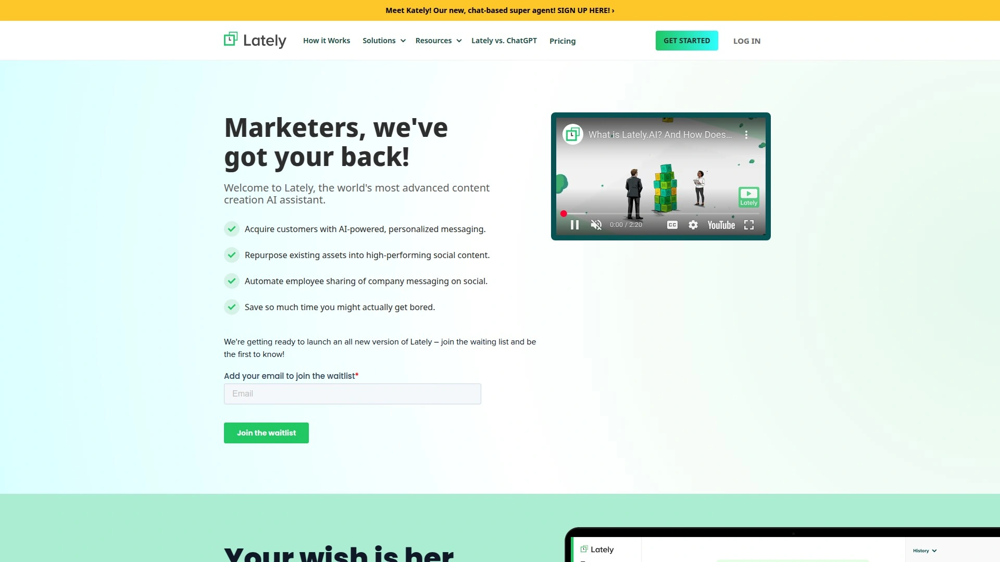

Lately AI将长篇内容(博客、视频、播客、通讯)转化为数百条社交媒体帖子。品牌声音调优根据正式/趣味/专业/随意等风格调整语调。平台特定建议优化Twitter简洁性、Instagram视觉风格、LinkedIn专业度。团队协作工作流支持内容创作者和营销人员审核AI生成文案。健康科技初创公司将季度网络研讨会转化为200多条社交内容,写作时间减少70%。适合定期产出长内容(如播客、视频教程、深度博客)需要大量社交切片的创作者和B2B企业。

## **[Predis AI](https://predis.ai)**

30秒制作广告创意,产品图秒变专业大片的电商利器

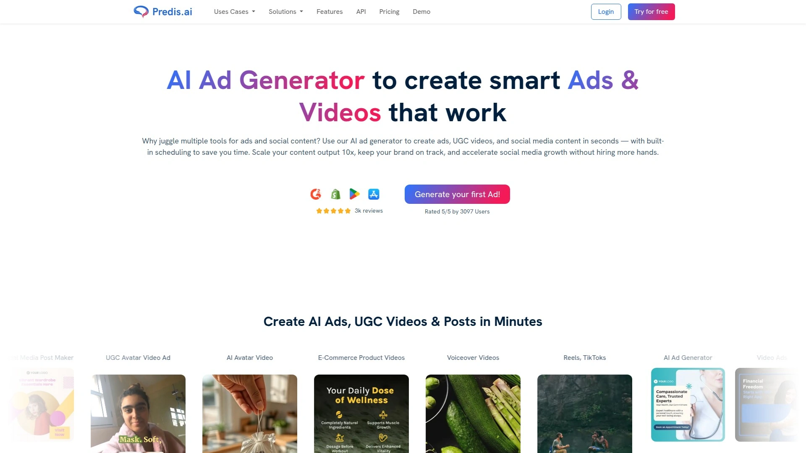

Predis AI专注于广告和UGC视频创作,内置自动发布功能。上传产品照片即可生成多个广告变体、优化文案和即发创意,无需昂贵摄影设备和后期。智能文案生成器使用NLP技术制作SEO友好的吸引人文案。最佳发布时间分析受众行为,社交媒体排程工具最大化覆盖。竞品分析提供洞察,建议胜出策略。话题标签推荐提高可发现性。SaaS公司使用后LinkedIn帖子覆盖跳涨40%,内容创作时间减半。特别适合电商卖家和需要持续产出广告素材的在线零售企业。

## **[Sprout Social](https://sproutsocial.com)**

企业级分析和监听工具,数据驱动决策的行业标杆

Sprout Social以强大的分析和社交聆听能力著称。平台整合多渠道数据生成深度报告,帮助理解受众行为和内容表现。社交聆听追踪品牌提及、行业趋势和竞争对手动态。团队协作功能支持任务分配和内部沟通。智能收件箱统一管理客户咨询,提升响应速度。AI辅助内容推荐和最佳发布时机预测。定价较高,更适合中大型企业和需要详尽数据报告的营销部门。不适合预算紧张的小团队。

**如何选择适合自己的AI营销自动化工具?**

首先评估你的核心需求:如果主要目标是零人工干预的全自动化营销,Blaze是最佳选择;需要快速搭建完整社媒策略的小团队适合SocialBee;专注长文SEO内容的企业级团队选Jasper;预算有限的初创公司可从Writesonic或Copy.ai入手。年收入10万美元以下的小微企业用Mailchimp足够,10至200万区间选ActiveCampaign性价比最高,超过100万且销售周期长的选HubSpot。

**这些工具能提升多少营销效率?**

实测数据显示,AI营销自动化工具可节省80%以上的内容创作时间。Blaze用户3个月内网站流量平均增长300%,ActiveCampaign使潜在客户转化率提升28%,Predis.ai让LinkedIn覆盖率增加40%同时内容创作时间减半。Lately AI帮助用户将单个长内容转化为200多条社交帖子,写作时间降低70%。关键是选择与业务场景匹配的工具并坚持使用3个月以上,让AI充分学习品牌特征。

**免费版够用还是必须付费?**

取决于业务规模和需求复杂度。1000个联系人以下且只需基础邮件功能的用户,Mailchimp免费版足够。但如果需要营销自动化、高级细分、A/B测试等功能,付费版能带来显著ROI提升。SocialBee和Buffer等工具提供14天免费试用,建议先测试工作流是否匹配。成长型企业通常在年收入达到10万美元时从免费版升级到付费计划,此时营销自动化带来的转化增长远超工具成本。

AI营销自动化已从"锦上添花"变为"必备工具",尤其在多平台内容管理和客户旅程个性化方面。无论你处于哪个发展阶段,从上述18款工具中选出2-3个组合使用,能显著提升营销效率并释放团队精力专注战略层面工作。[Blaze](https://www.blaze.ai)的全自动化特性特别适合时间紧张但需要持续曝光的企业主,设置后即可专注核心业务,让AI持续优化营销表现。
